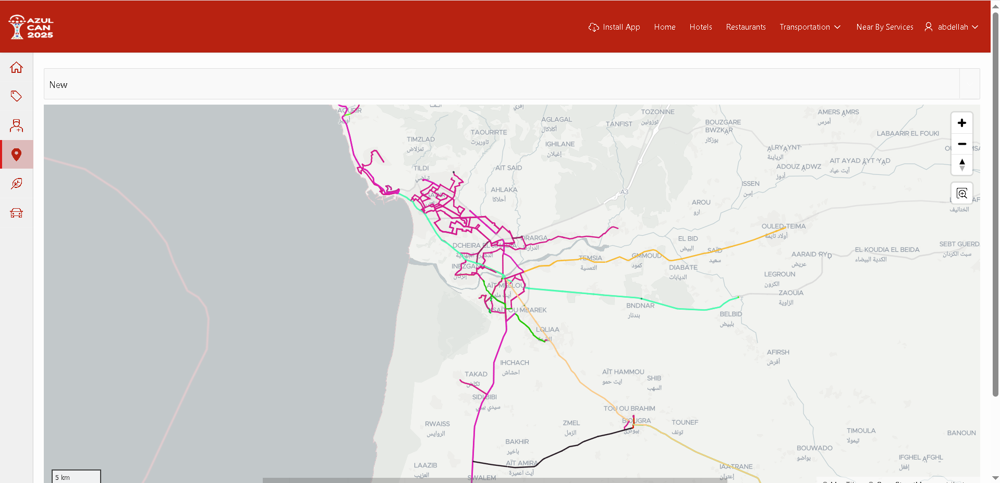
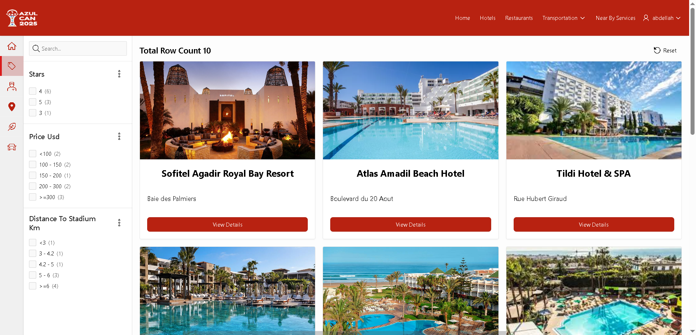
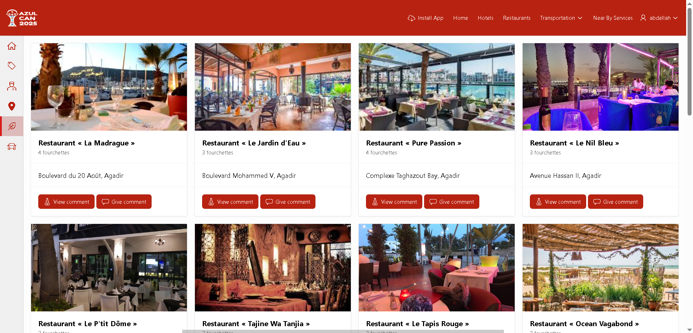
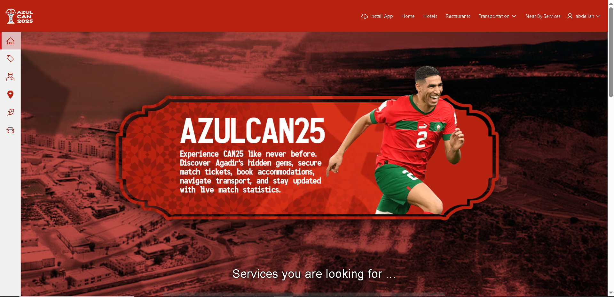
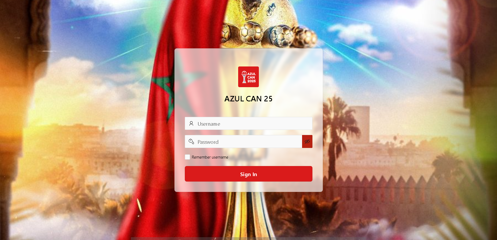

# AzulCAN25 – Oracle APEX Web App for CAN 2025 Visitors

AzulCAN25 is a web application built with Oracle APEX to support football fans and tourists during the 2025 Africa Cup of Nations (CAN) in Agadir. It brings together tourism, logistics, and live match features in one place.

---

## ❗ The Problem

Visitors and fans coming to Agadir for CAN 2025 face scattered tools and limited guidance when it comes to:

- Discovering the city’s local gems
- Finding nearby essential services (snack shops, pharmacies, hospitals)
- Booking restaurants and hotels
- Renting cars and coordinating local transport
- Accessing live match stats and locating fan zones

---

## ✅ Our Solution

**AzulCAN25** is a centralized platform that serves as a personal assistant during the tournament. It combines local recommendations, service maps, booking tools, and football features into a single, easy-to-use app.

---

## 🔧 Built With

- Oracle APEX 23.x
- Oracle Database
- PL/SQL
- JavaScript & CSS (for minor frontend touches)

---

## 🚀 Features

- 🗺️ Explore Agadir’s hidden gems and must-see places
- 🏥 Real-time map of essential services (pharmacies, hospitals, etc.)
- 🍽️ Book restaurants and hotels easily
- 🚗 Rent cars and coordinate transport
- ⚽ Stay updated with match stats and find fan zones

---

## 🛠️ How to Use

1. Clone or download this repo
2. Import `azulcan25.sql` from the `exports/` folder into your Oracle APEX environment
3. (Optional) Set up any necessary tables from `docs/schema.sql`
4. Run the app from the APEX dashboard

---

## 📸 Screenshots

Below are key features of AzulCAN25:

### 🏠 Home Page

### 🚍 Buses Info

### 🚗 Car Rental

### 🛏️ Hotels

### 🛏️ Alternative Hotels View

### 🍽️ Restaurants

### 🙋 Hero Section (Landing)

### 🔐 Login Page

---

## 👥 Team & Hackathon Info

This project was built in **less than 48 hours** during an Oracle Hackathon in Agadir.

Team members:
- **Oussama Elmessaoudi**
- **Noureddine Ait Moulay Brahim**
- **Abdellah Abrkaoui**
- **Ilyas Chrami**

---

## 📂 Project Structure
AzulCAN25-Oracle-APEX-App/
├── exports/ # APEX app SQL export
├── screenshots/ # UI previews for README
├── README.md

---

## 🔗 License

This project is open for educational and demo purposes. Contact us for permission if you plan to use it in production or events.

